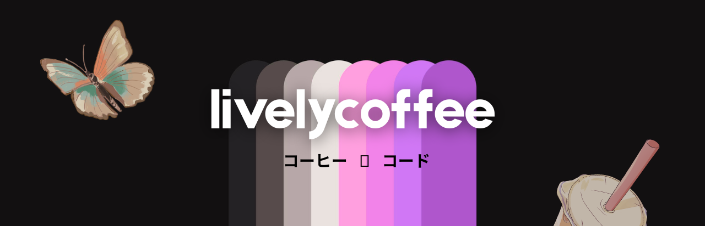

  

 

<h1 align="center">A little bit of coffee, a little bit of code...</h1>

<h3 align="center">🎓 <b>Student</b> &middot; (kind/curious)</h3>

  
  
  

 

<blockquote>
  Hey, I'm <b>LC</b>! 👋 - I'm a python developer, aerospace entusiast and university student, with a curious mind and a kind heart. I'm interested in low level development, linux internals, AI related projects and anything out there that's aerospace or computer science related! I want to invest in building a happier and safer opensource community, and do fun projects in my free time.
</blockquote>

 

- 🔭 Currently working on **AI** and **Aerospace** related projects  
- 🌱 Learning **low level** programming along with **Rust**  
- 📫 Reach me at livelycoffee18@gmail.com or on LinkedIn

 

<blockquote>
  I'm always open to any kind of help I can provide with all sorts of opensource projects! 😊
</blockquote>

 

<h2 align="center">
  
  &nbsp;
  Toolbox
</h2>

  
   
  

 

<h2 align="center">
  
  &nbsp;
  GitHub Stats
</h2>

</img>

 

---

<!--
**livelycoffee/livelycoffee** is a ✨ _special_ ✨ repository because its `README.md` (this file) appears on your GitHub profile.

Here are some ideas to get you started:

- 🔭 I’m currently working on ...
- 🌱 I’m currently learning ...
- 👯 I’m looking to collaborate on ...
- 🤔 I’m looking for help with ...
- 💬 Ask me about ...
- 📫 How to reach me: ...
- 😄 Pronouns: ...
- ⚡ Fun fact: ...
-->
